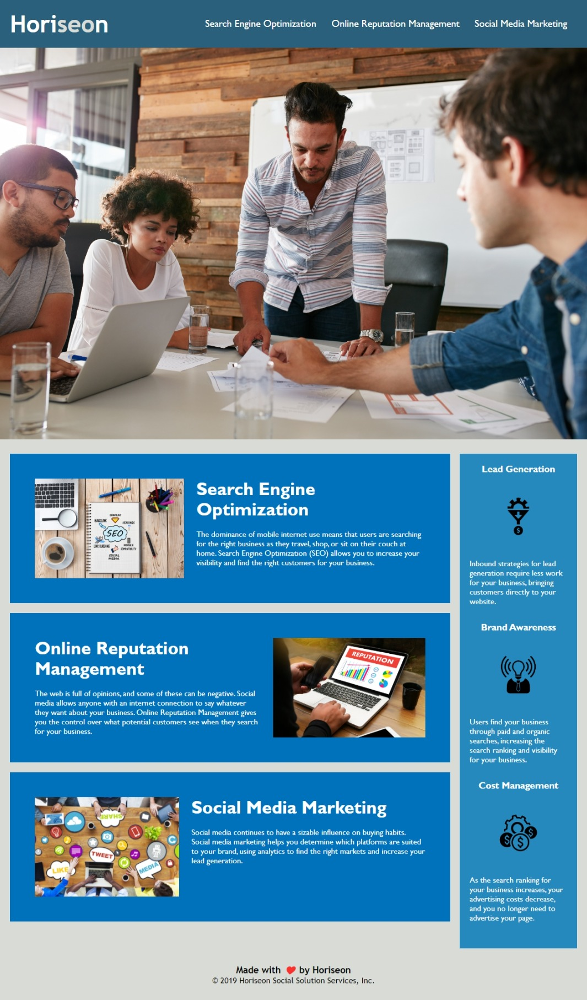

# 01-HTML-CSS-Git-refactor-solution

## Description

This repository contains all files associated with the HTML CSS Git refactored code challenge. The project aimed to make the Horiseon website more accessible to disabled people using assistive technologies, on behalf of a marketing agency. This project enabled me to apply semantic elements to a real world problem and think carefully about the impact that different tags have on users' experiences of a website. This project also gave me more exposure to using Github as a platform for version control.

## Usage

Please see below for a screenshot of the refactored website.

Please refer to the link below to access the refactored website.

## License
